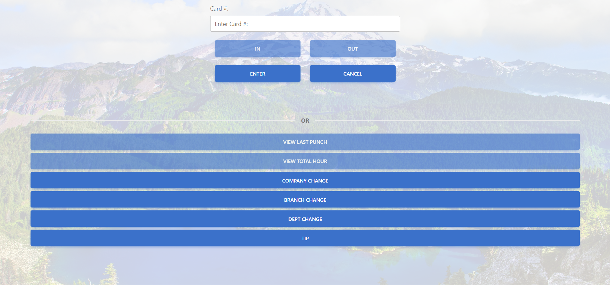
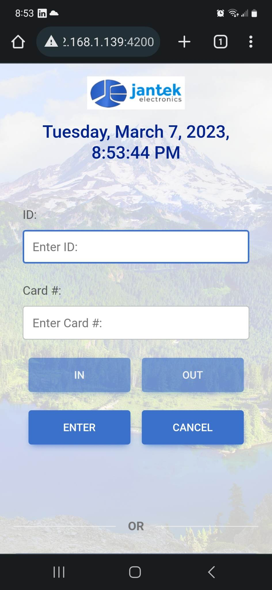
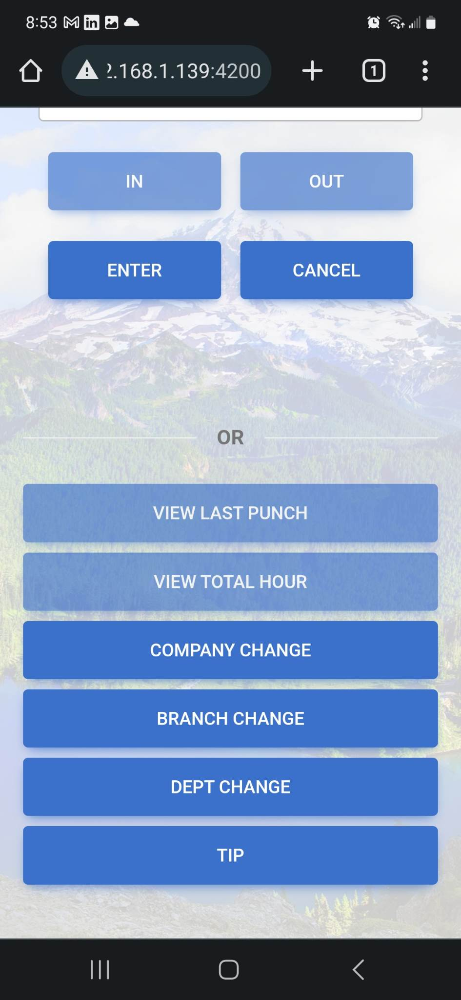

# Jta-Web-Punch-V1
Angular front end for Jta Web Punch

<a href="https://tomastrajan.medium.com/how-to-build-responsive-layouts-with-bootstrap-4-and-angular-6-cfbb108d797b">Responsive Layout with Bootstrap</a>

<a href="https://mdbootstrap.com/docs/standard/extended/login/#docsTabsOverview">Sign in form layout</a>

Desktop Look:

Mobile Look:

